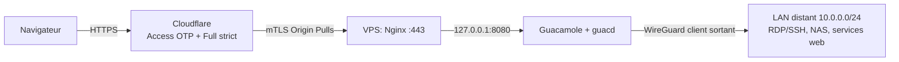

# Bastion VPS release package (Apache Guacamole)

Ce dossier est une base anonymisee pour deployer un bastion d'administration a
distance sur un petit VPS : acces web SSH / RDP / VNC via Apache Guacamole, a
travers un tunnel WireGuard, derriere Nginx et Cloudflare (TLS + authentification).

Toutes les valeurs sensibles (domaines, IP, identifiants) sont des exemples
fictifs. Remplacer les `<...>` avant de deployer.

Contenu:
- `compose.yml`: stack Docker durcie (Guacamole + guacd + PostgreSQL)
- `nginx-bastion.conf`: reverse proxy HTTPS + mTLS Cloudflare (Authenticated Origin Pulls)
- `wg0.example.conf`: modele de config client WireGuard
- `50unattended-upgrades`: mises a jour de securite automatiques (Debian)
- `secrets/db_password.txt.example`: placeholder du secret DB (jamais committe)
- `theme/`: sources du theme sombre Guacamole + `build.sh` (genere le `.jar`)
- `DEPLOYMENT.md`: guide de deploiement pas-a-pas complet
- `README.md` (racine du dossier): documentation projet + personnalisation du theme

## Architecture exemple

Le VPS est **client** d'un serveur WireGuard distant : il compose vers le site
distant en sortie et n'expose aucun port entrant cote LAN.

## Procedure (ordre recommande)
1. Telecharger la release GitHub, puis extraire le contenu sur le VPS (ex. `/opt/guacamole`).
2. Construire le theme: `( cd theme && ./build.sh )` (genere `guacamole-home/extensions/dark-theme.jar`).
3. Generer le secret DB: `openssl rand -base64 32 | tr -d '\n' > secrets/db_password.txt` (chmod 644).
4. Generer le schema d'init (meme version que l'image du compose):
   `docker run --rm guacamole/guacamole:1.5.5 /opt/guacamole/bin/initdb.sh --postgresql > initdb/init.sql`
5. Lancer la stack: `docker compose up -d` (Guacamole ecoute sur `127.0.0.1:8080`).
6. Changer immediatement le mot de passe `guacadmin` / `guacadmin`.
7. Deployer WireGuard, Nginx et Cloudflare comme decrit dans `DEPLOYMENT.md`.

## Notes
- Les fichiers sont anonymises et servent de base.
- Images Docker pinnees (pas de `latest`) : l'image `guacamole` et `initdb.sh` doivent
  partager la meme version.
- Le port `8080` n'est jamais expose publiquement ; Nginx n'accepte le `443` que depuis
  les plages IP Cloudflare.
- Voir la checklist de securite complete dans `DEPLOYMENT.md` (Etape 6).
