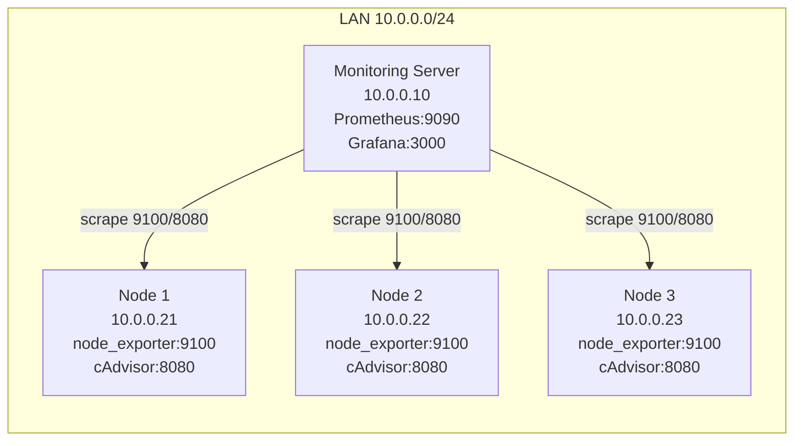

# Monitoring release package (Prometheus + Grafana)

Ce dossier est une base anonymisee pour une stack de monitoring avec Prometheus et Grafana. Il contient des exemples de configuration pour le scraping, le stockage, la visualisation des métriques avec des dashboards et des alertes.

Contenu:
- `stack-server/docker-compose.yml`: stack serveur de monitoring (Prometheus + Grafana)
- `stack-server/prometheus/prometheus.yml`: cibles d'exemple anonymisees
- `stack-server/grafana/provisioning/alerting/*.yaml`: exemples de regles d'alertes/notifications Grafana
- `stack-nodes/docker-compose-node-observability.yml`: compose dedie aux noeuds (node_exporter + cadvisor)
- `dashboards/*.example.json`: dashboards d'exemple

## Architecture exemple
Reseau local d'exemple en `10.0.0.x`:
- serveur monitoring: `10.0.0.10`
- noeud 1: `10.0.0.21`
- noeud 2: `10.0.0.22`
- noeud 3: `10.0.0.23`

## Procedure (ordre recommande)
1. Telecharger la release GitHub, puis extraire le contenu sur la machine qui heberge Prometheus/Grafana.
2. Editer `stack-server/prometheus/prometheus.yml` pour ajuster les IP de vos noeuds.
3. Sur chaque noeud a superviser, deployer `stack-nodes/docker-compose-node-observability.yml`:
   - `docker compose -f docker-compose-node-observability.yml up -d`
4. Sur le serveur monitoring, deployer `stack-server/docker-compose.yml`:
   - `docker compose up -d`
5. Verifier Prometheus: `http://10.0.0.10:9090/targets`.
6. Ouvrir Grafana: `http://10.0.0.10:3000` puis changer le mot de passe admin.
7. Importer les dashboards depuis `dashboards/*.example.json`.
8. Configurer la datasource Prometheus dans Grafana, puis remplacer `REPLACE_WITH_PROMETHEUS_UID` dans:
   - `stack-server/grafana/provisioning/alerting/rules.yaml`
9. Redemarrer Grafana pour charger les regles d'alerting provisionnees:
   - `docker compose restart grafana`

## Notes
- Les fichiers sont anonymises et servent de base.
- Remplacer les adresses email/webhook dans `contact-points.yaml`.
- Le nom du fichier noeuds est volontairement explicite: `docker-compose-node-observability.yml`.
