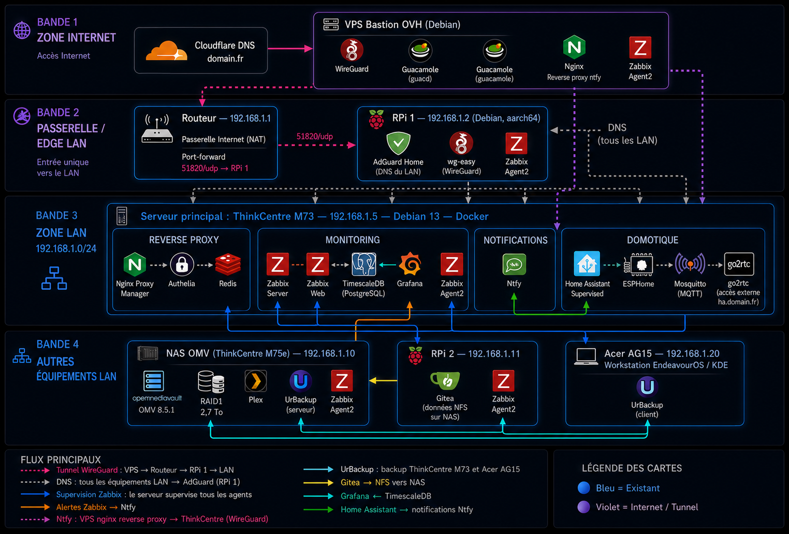

# Documentation homelab

> 🟢 Ce homelab est **100 % open source** - tous les logiciels et outils utilisés sont des projets libres et gratuits (FOSS).

  
  
    
  
  
  
  
  
  
  
  
  
  
  
  
  
  
  
  
  
  

## 📋 Vue d'ensemble

Homelab auto-hébergé articulé autour d'un serveur principal, d'un NAS, de deux
Raspberry Pi et d'un VPS bastion. Tous les services sont conteneurisés (Docker)
ou déployés en binaires/systemd, supervisés par Zabbix et accessibles à distance
via un tunnel WireGuard sans ouvrir le moindre port entrant côté maison.

- **Réseau interne** : domaines `*.home.lab` résolus par AdGuard Home et routés
  par Nginx Proxy Manager (TLS auto-signé), protégés par Authelia (2FA TOTP).
- **Exposition internet** : domaines `*.domain.fr` en Let's Encrypt (challenge
  DNS Cloudflare), point d'entrée unique via le VPS bastion + Cloudflare.
- **Accès distant** : Apache Guacamole (SSH / RDP / VNC dans le navigateur) sur
  le bastion, relié au LAN par WireGuard.

## 🗺️ Architecture

  

## 🧰 Matériel et services

### 🖥️  - Serveur principal

AMD Athlon II X4 640 · 8 Go DDR3 · 465 Go · **Debian 13 (Trixie)**

Serveur central du homelab, hébergeant Home Assistant Supervised et quatre
stacks Docker indépendantes :

* **[Home Assistant Supervised](homeassistant/)** pour la domotique (addons :
  ESPHome, Mosquitto, go2rtc, SSH, HACS) — accès via `ha.domain.fr`
* **[Authelia](authelia/) + Redis** — authentification centralisée 2FA TOTP
* **[Nginx Proxy Manager](nginx-proxy-manager/)** — reverse proxy centralisé
  (`*.home.lab` auto-signé, `*.domain.fr` Let's Encrypt via Cloudflare DNS)
* **[Zabbix Server 7.0 + TimescaleDB + Grafana](monitoring/)** — supervision de
  l'ensemble du homelab (5 agents, monitoring SSL, alertes ntfy)
* **[Ntfy](ntfy/)** — notifications push self-hosted, exposé via le VPS bastion

Hardening : nftables (policy drop), SSH clé ed25519 uniquement, Fail2ban,
unattended-upgrades, journald limité, docker prune hebdomadaire.

### 💾  - NAS

2 × disques en RAID 1 (md0, ext4, ~2.2 To) · **OpenMediaVault 8.5.1 (Synchrony)**
sur Debian 13

* **[UrBackup Server](urbackup/)** (conteneur Docker) — backups centralisés
  fichiers et images disque du ThinkCentre et du poste de travail
* **Plex Media Server** (conteneur Docker) — diffusion de médias
* **Zabbix Agent2** (systemd) — supervision par le serveur Zabbix

### 🧩 

**RPi 3B - AdGuard & WireGuard** · Debian 13 (Trixie) aarch64

* **[AdGuard Home](adguard-home/)** (binaire standalone) — DNS filtré pour tout
  le réseau, réécriture `*.home.lab` vers le ThinkCentre, alertes et rapports
  quotidiens via [ntfy](ntfy/)
* **[wg-easy](wgeasy/)** (conteneur Docker) — serveur WireGuard avec interface
  web, utilisé par le VPS bastion pour rejoindre le LAN
* **Zabbix Agent2** (systemd) — supervision par le serveur Zabbix

**RPi 3B - [Gitea](gitea/)** · Raspberry Pi OS Lite (Trixie 32-bit)

* **Gitea 1.26.4** (binaire standalone) — hébergement Git self-hosted avec wiki
  Markdown, données stockées sur le NAS via NFS
* **Zabbix Agent2** (systemd) — supervision par le serveur Zabbix

### ☁️  - [Bastion](bastion-vps/)

VPS Debian 13 servant de **bastion d'administration à distance** et de point
d'entrée internet pour les services exposés :

* **Apache Guacamole** (conteneurs Docker) — accès web SSH / RDP / VNC, sans
  client lourd
* **Client WireGuard** vers le wg-easy du RPi : le VPS rejoint le LAN sans
  ouvrir aucun port entrant côté maison
* **Nginx reverse proxy** pour Guacamole et [ntfy](ntfy/) — TLS via Cloudflare
  (Full strict + Authenticated Origin Pulls + Cloudflare Access) et Let's Encrypt
* Stack Docker durcie (réseaux `internal`, secrets, `cap_drop`, `read_only`,
  images pinnées) et hardening de l'hôte (SSH par clé, UFW, Fail2ban)

## 📦 Stacks documentées

| Stack | Hôte | Description |
|-------|------|-------------|
| [Home Assistant](homeassistant/) | ThinkCentre M73 | Domotique (Supervised) + addons ESPHome, Mosquitto, go2rtc |
| [Authelia](authelia/) | ThinkCentre M73 | Authentification centralisée 2FA (TOTP) + Redis |
| [Nginx Proxy Manager](nginx-proxy-manager/) | ThinkCentre M73 | Reverse proxy, TLS interne et Let's Encrypt |
| [Monitoring](monitoring/) | ThinkCentre M73 | Zabbix Server 7.0 + TimescaleDB + Grafana |
| [Ntfy](ntfy/) | ThinkCentre M73 | Notifications push self-hosted |
| [UrBackup](urbackup/) | NAS OMV | Backups centralisés fichiers + images disque |
| [AdGuard Home](adguard-home/) | RPi 3B | DNS filtré réseau + réécriture `*.home.lab` |
| [wg-easy](wgeasy/) | RPi 3B | Serveur WireGuard (interface web) |
| [Gitea](gitea/) | RPi 3B | Hébergement Git self-hosted + wiki |
| [Bastion VPS](bastion-vps/) | OVH VPS | Apache Guacamole durci + Cloudflare |

## 🔐 Bastion / accès distant

La stack complète du bastion (Guacamole + WireGuard + Nginx/Cloudflare) est
documentée dans [bastion-vps/](bastion-vps/).

## Licence

Ce projet est distribué sous licence [GPL-3.0](./LICENSE).